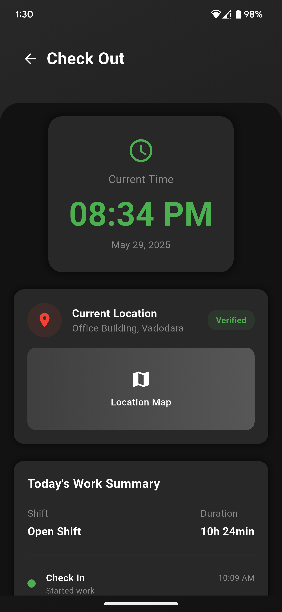
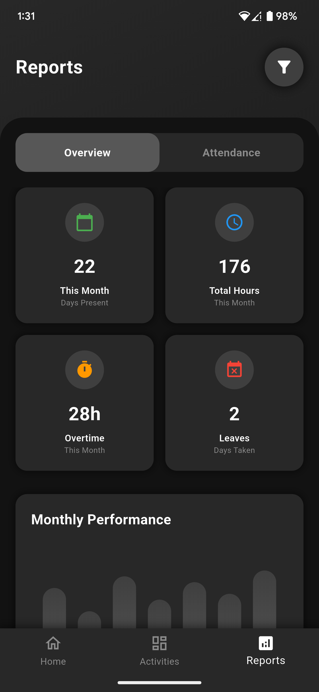
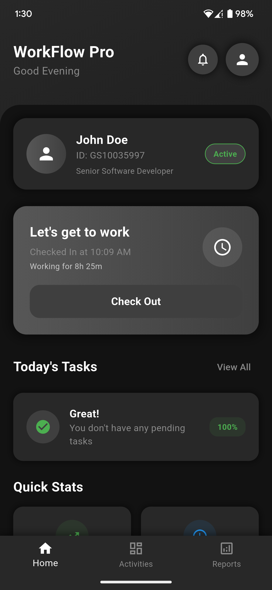
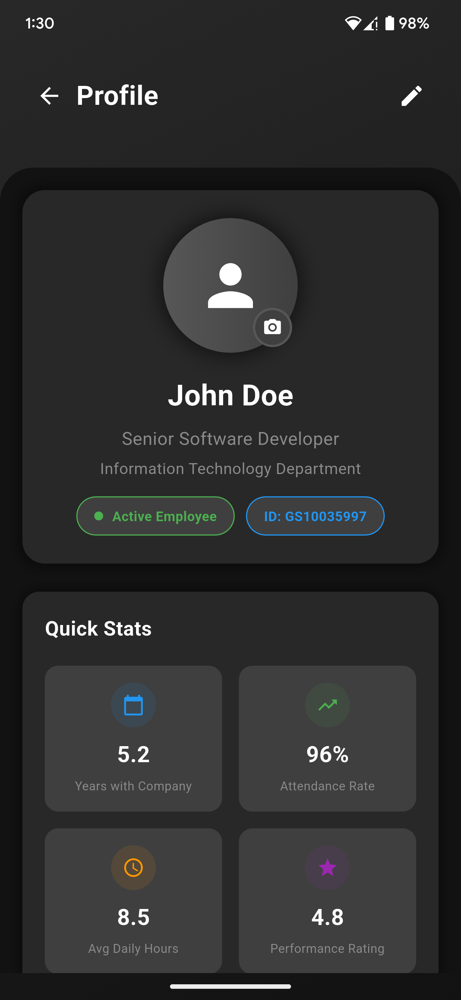
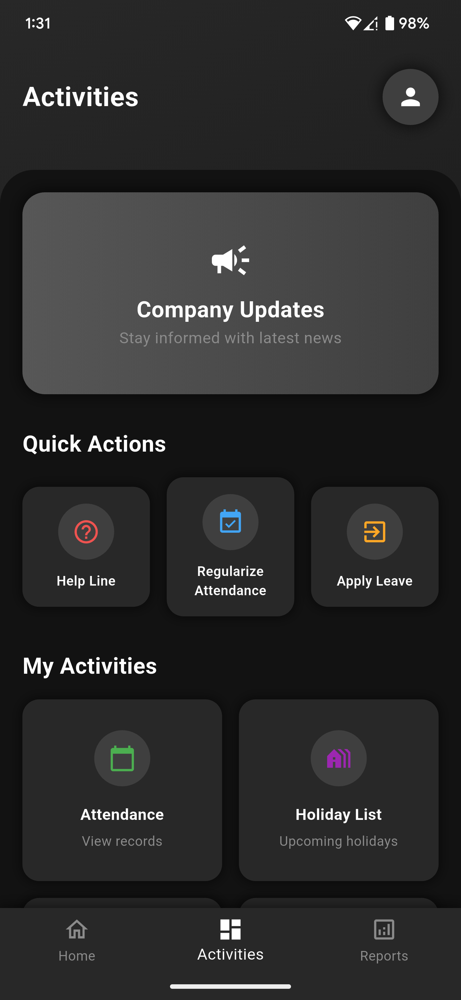
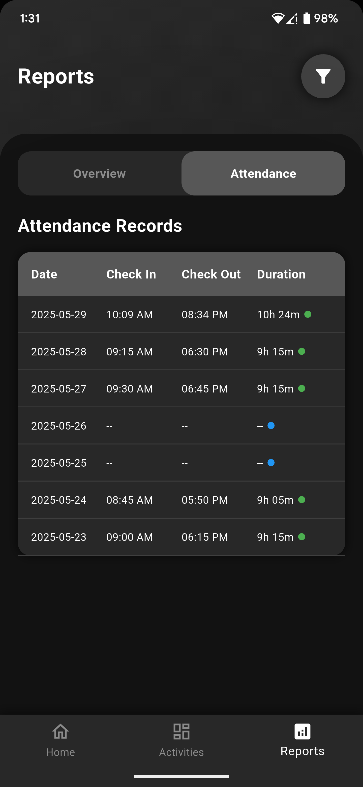
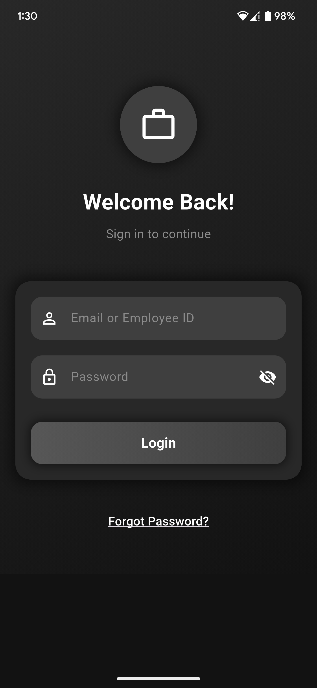
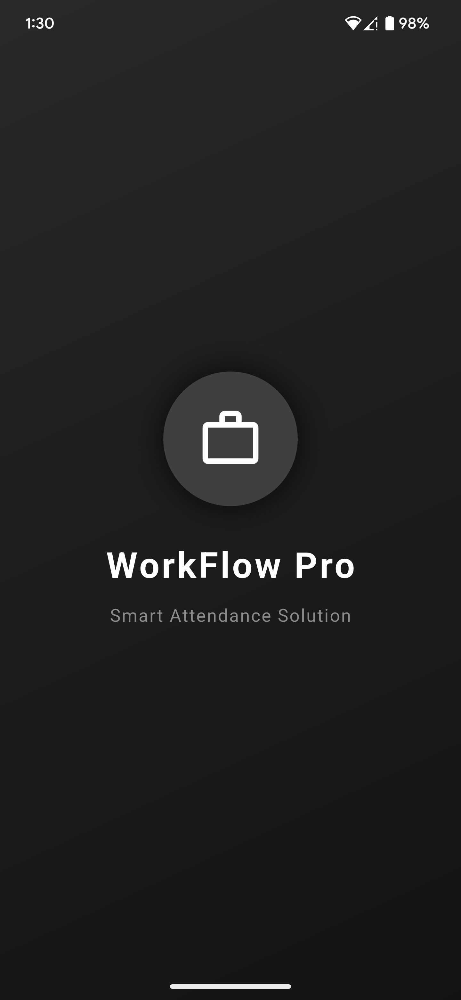

# 📱 Flutter Employee Attendance App

A modern and intuitive employee attendance tracking application built with Flutter. This app provides a clean, user-friendly interface for managing employee attendance with features like clock-in/clock-out, attendance history, and profile management.


## ✨ Features

- **Modern UI Design** - Clean and intuitive user interface
- **Authentication System** - Secure login and registration
- **Home Dashboard** - Comprehensive overview of attendance data
- **Activities Tracking** - Real-time attendance monitoring
- **Reports & Analytics** - Detailed attendance reports
- **Profile Management** - Employee profile and settings
- **Responsive Design** - Works seamlessly across different screen sizes
- **Material Design** - Following Google's Material Design guidelines

## 📸 Screenshots

<div align="center">
  
  
  
  
</div>

<div align="center">
  
  
  
  
</div>

## 🚀 Getting Started

### Prerequisites

- Flutter SDK (>=3.0.0)
- Dart SDK (>=3.0.0)
- Android Studio / VS Code
- Git

### Installation

1. **Clone the repository**
   ```bash
   git clone https://github.com/tilakpatel22/employee-attendance-app-flutter.git
   cd employee-attendance-app-flutter
   ```

2. **Install dependencies**
   ```bash
   flutter pub get
   ```

3. **Run the app**
   ```bash
   flutter run
   ```

## 📱 Platform Support

| Platform | Status |
|----------|--------|
| Android  | ✅ Supported |
| iOS      | ✅ Supported |
| Web      | ✅ Supported |
| Desktop  | ⚠️ Not tested |

## 🛠️ Built With

- **[Flutter](https://flutter.dev/)** - UI framework
- **[Dart](https://dart.dev/)** - Programming language
- **Material Design** - Design system

## 📁 Project Structure

```
lib/
├── main.dart                 # Entry point
├── main_navigation.dart      # Navigation setup
├── auth_screens.dart         # Authentication screens
├── home_screen.dart          # Home dashboard
├── activities_screen.dart    # Activities/Attendance tracking
├── reports_screen.dart       # Reports and analytics
├── profile_screen.dart       # User profile management
├── widgets/                  # Reusable widgets
├── models/                   # Data models
├── services/                 # Business logic
└── utils/                    # Utility functions

assets/
├── images/                   # App images
└── fonts/                    # Custom fonts
```

## 🎯 Current Status

This project currently includes:
- ✅ Complete UI implementation
- ✅ Multiple screens and navigation
- ✅ Responsive design
- ⏳ Backend integration (planned)
- ⏳ Database connectivity (planned)
- ⏳ Authentication system (planned)

## 🚧 Upcoming Features

- [ ] Firebase integration
- [ ] Real-time attendance tracking
- [ ] Push notifications
- [ ] Biometric authentication
- [ ] Offline mode support
- [ ] Admin panel
- [ ] Reports and analytics
- [ ] Export functionality

## 🤝 Contributing

Contributions are welcome! Here's how you can help:

1. Fork the project
2. Create your feature branch (`git checkout -b feature/AmazingFeature`)
3. Commit your changes (`git commit -m 'Add some AmazingFeature'`)
4. Push to the branch (`git push origin feature/AmazingFeature`)
5. Open a Pull Request

## 📝 License

This project is licensed under the MIT License - see the [LICENSE](LICENSE) file for details.

## 👨‍💻 Author

**Tilak Patel**
- GitHub: [@tilakpatel22](https://github.com/tilakpatel22)
- LinkedIn: [Tilak Patel](https://www.linkedin.com/in/tilak-patel-99993b18a/)
- Email: nikultilak@gmail.com

## 🙏 Acknowledgments

- Flutter team for the amazing framework
- Material Design for the design guidelines
- Open source community for inspiration

## 📞 Support

If you found this project helpful, please give it a ⭐️!

For support, email nikultilak@gmail.com or open an issue on GitHub.

---

<div align="center">
  Made with ❤️ using Flutter
</div>